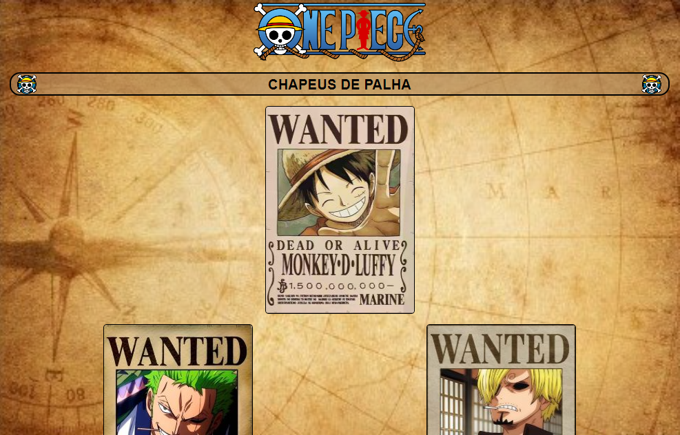
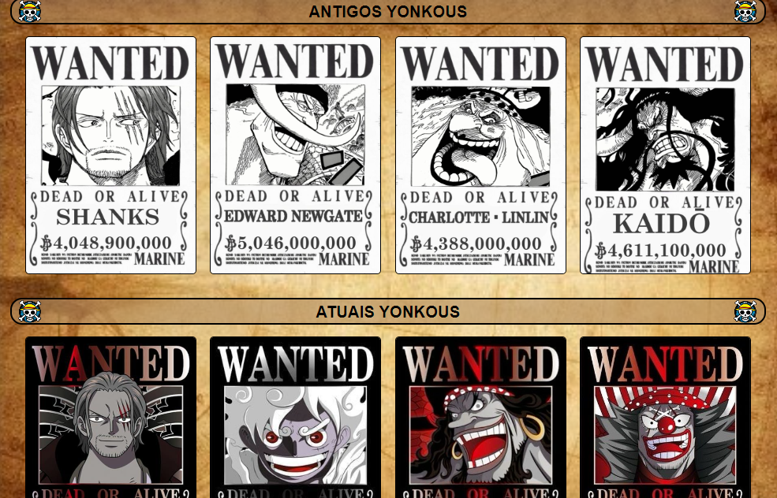
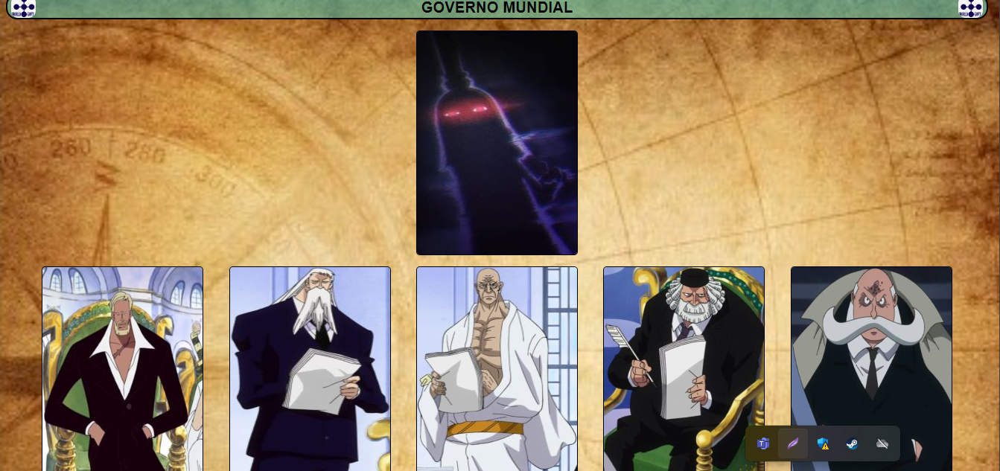
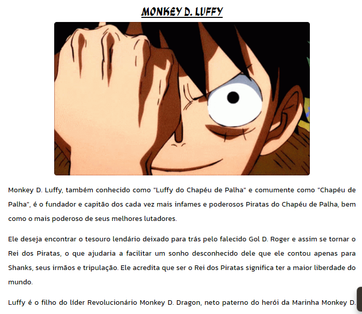
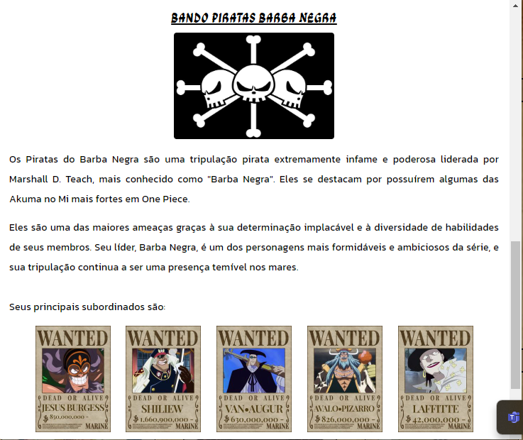

# OnePiece

Projeto sobre o universo do Mangá/Anime de One Piece ☠ ⚓

## Índice

- <a href="#estrutura">Estrutura do Projeto</a>
- <a href="#layout">Layout</a>
- <a href="#tecnologias">Tecnologias Utilizadas</a>
- <a href="#autora">Pessoa Autora</a>
- <a href="#passos">Próximos Passos</a>

## 📚 Estrutura do Projeto

- [x] Cartazes do Bando dos Chápeus de Palha (Protagonistas);
- [x] Cartazes dos Yonkous (Antigos e Atuais);
- [x] Cartazes dos Shishibukais;
- [x] Cartazes do Exército Revolucionário;
- [x] Cartazes da Marinha (Vice Almirantes);
- [x] Cartazes dos Almirantes da Marinha;
- [x] Cartazes do Governo Mundial;
- [x] Todos os cartazes são clicáveis abrindo um modal com mais informações sobre o personagem específico;

## 📱 Layout

## 🛠 Tecnologias Utilizadas

1. [Angular](https://angular.dev/)
2. [Angular Material Dialog](https://material.angular.io/components/dialog/overview)

## © Pessoa Autora

[Linkedin](https://www.linkedin.com/in/araujo-juliano/)

## 💡 Próximos Passos

- [ ] Aumentar os personagens disponíveis;
- [ ] Colocar sessão de Navios;
